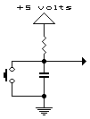

# Table of Contents
* [introduction](#introduction)
* [prerequisites](#prerequisites)
* [notes](#notes)

# introduction
* simple code to control led by switch using interrupts and read temperature sensor value 
https://youtu.be/-GAm9ZOLQSg

 

 

# prerequisites
* this code was tested on arduino uno board so you may need to change things if you use a different board 
* battery 5V   warning! don't change battery value if you can't calculate the  resistor value 
* LED
* ARDUINO IDE to burn the code on the chip
* Switch 
* LM35 analog temperature sensor 
* 330k ohm resistor
* 10k ohm resistor if you won't activate internal pull up resistor  

*
  

# notes
* DEBOUNCE RC CIRCUIT 
* You may solve debounce problem in software but in this example i choose the hardware method ):

*
